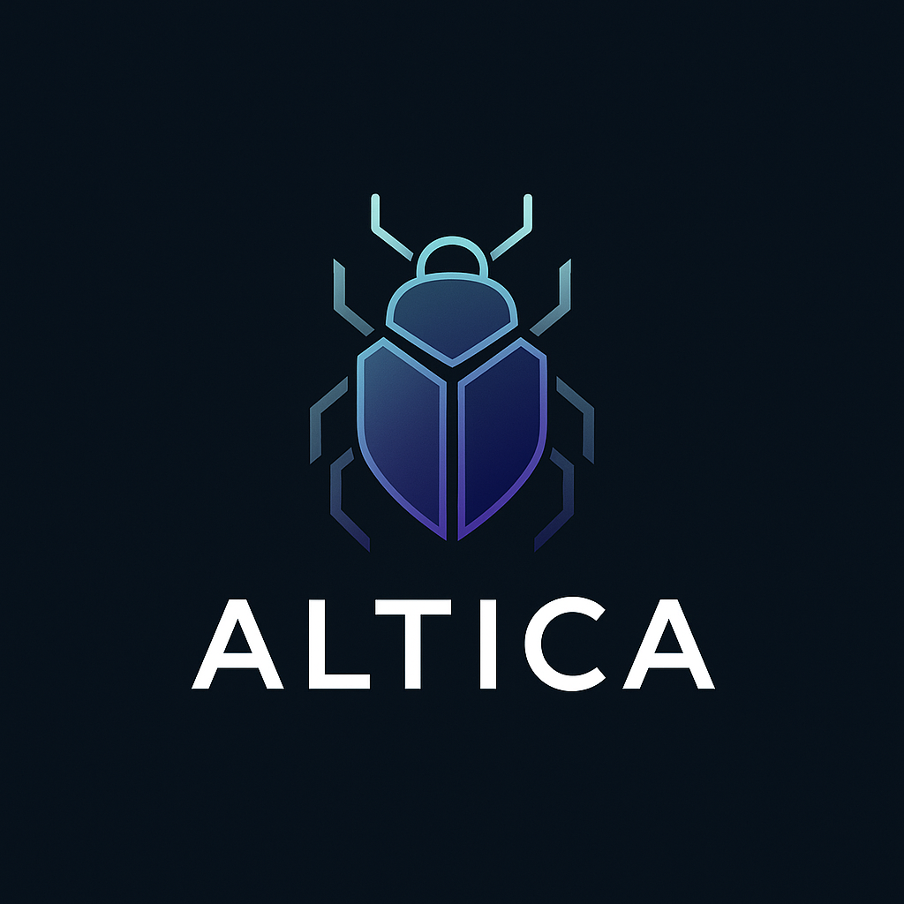

# Altica: A Sovereign, Decentralized DNS Protocol

## Abstract

Altica is a sovereign, decentralized naming and resolution system for next-generation internet infrastructure. It introduces a root-native DNS architecture with built-in privacy, off-chain metadata storage, multi-chain address binding, and peer-to-peer state synchronization. Altica eliminates reliance on centralized L1 chains and external databases by combining smart contract anchors, libp2p gossip, and threshold-consensus mechanisms.

## Introduction

Centralized naming systems and partial-decentralization models (e.g., ENS on Ethereum) still suffer from censorship risks, on-chain cost inefficiencies, and siloed ecosystems. Altica aims to build a censorship-resistant, cross-chain, and self-governing name system from first principles—supporting privacy-preserving query resolution, decentralized governance, and local-first persistence.

## Problem Statement

Existing systems fall short in:

* Trustless multi-chain address binding
* Resolver decentralization and availability
* Privacy-respecting query protocols
* Avoiding centralized storage and on-chain cost burdens

## Vision and Mission

Altica envisions a future where identity and naming are fully sovereign, globally interoperable, and resilient. We aim to:

* Support a sovereign `.alt` root zone with fully decentralized registration
* Use libp2p, gossipsub, and LevelDB for storage without remote dependencies
* Enable resolvers to function without central servers or cloud APIs
* Introduce zk-resolved queries and optional on-chain proof-of-ownership
* Empower community governance via the Infrade DAO

## Core Components

### 1. Root Namespace

Altica defines its own sovereign root zone (e.g., `.alt`) with open registration, rent-based renewal, and fee settlement via smart contracts on supported chains.

### 2. AlticaNode

The primary node type that:

* Accepts signed transactions from users (binding, renewal, record updates)
* Validates domain status across the network
* Participates in consensus (if elected)
* Stores finalized domain state in a local `StateTrie`
* Gossips records and bindings to peer nodes

### 3. Smart Contracts (Anchors)

Deployed to supported blockchains (e.g., Ethereum, Base), these contracts:

* Receive pre-authorized binding fee deposits
* Validate ownership during renewals
* Emit on-chain resolver metadata for verification
* Facilitate optional refunds when binding is not finalized

### 4. ConsensusGroup

A rotating subset of AlticaNodes (based on config, stake, or participation) that:

* Vote on the validity of submitted binding intents
* Reach ≥51% quorum before finalization
* Sign or approve intent to ensure global consistency

### 5. StateTrie

A persistent trie (LevelDB-based) that stores:

* Finalized domain-to-address bindings
* Off-chain records (A, TXT, social, etc.)
* Expiration timestamps

### 6. Off-chain Metadata

Each domain can store signed A/TXT/metadata records. These are:

* Submitted off-chain with user signatures
* Gossiped to other AlticaNodes
* Validated and written to local `StateTrie`

### 7. Interoperability Layer

Resolvers optionally support fallback to traditional DNS via gateways (e.g., DoH/DoT). Smart contracts expose chain-native resolver interfaces.

## Protocol Flow

**Step-by-step Summary:**

1. **Pre-Binding:**

   * User creates intent and signs `depositFeeTx`
   * Submits to AlticaNode
   * Node checks domain availability across peers
   * If available, it submits the fee to SmartContract

2. **Binding Submission:**

   * User signs and submits `SubmitBindingTx`
   * Node verifies intent via smart contract `eth_call`
   * Gossips the intent to peers

3. **Consensus:**

   * ConsensusGroup validates and votes
   * ≥51% approval finalizes the intent

4. **Finalization:**

   * Node submits final binding to SmartContract
   * Fee consumed, event emitted
   * Binding stored in local `StateTrie`, gossiped

5. **Record Updates:**

   * User submits signed A/TXT records
   * Node verifies and gossips
   * Peers write to StateTrie

6. **Renewal:**

   * User signs and submits `renewDomainTx`
   * Node validates ownership
   * Submits to SmartContract to extend expiry

7. **Refunds:**

   * If consensus fails or timeout passes
   * User can call `refundFee(intentHash)`

## Technical Roadmap

1. **Phase 1: Core Protocol + Testnet**

   * Resolver client, SmartContract alpha
   * Deposit logic, basic binding & gossip

2. **Phase 2: Consensus + Renewals**

   * Implement ConsensusGroup
   * BLS aggregation (optional)
   * Domain renewal logic

3. **Phase 3: Metadata + Interop**

   * A/TXT record system
   * DNS fallback

4. **Phase 4: Governance + zk**

   * Tokenless DAO launch (Infrade)
   * zkQuery integration
   * Credit scoring for consensus peers

## Scalability Considerations

* **ConsensusGroup** allows thousands of passive nodes to sync from hundreds of validators
* **Intent pre-signing** avoids duplicate work
* **Trie sharding** and Merkle proof sync for fast partial state bootstraps
* **BLS signatures** reduce vote aggregation bandwidth
* **Record diffs** minimize gossip payload size

## Security

* **Nonce and signature verification** for all user txs
* **Domain uniqueness checks** across chains during pre-binding
* **Refund rules** ensure safety against intent hijack
* **Sybil resistance** via staking or reputation

## Conclusion

Altica redefines naming with local-first storage, multi-chain integration, and sovereign root control. Its architecture scales horizontally, supports rich off-chain metadata, and aligns with long-term goals of censorship-resistance and cross-chain decentralization.

## Call to Action

Join the Altica open-source community to build the future of naming. Protocol developers, smart contract auditors, resolver operators, and privacy advocates are welcome.

Website: [www.altica.io](https://www.altica.io)
GitHub: [github.com/infrade/altica](https://github.com/infrade/altica)
Twitter: [@Altica](https://twitter.com/Altica)
